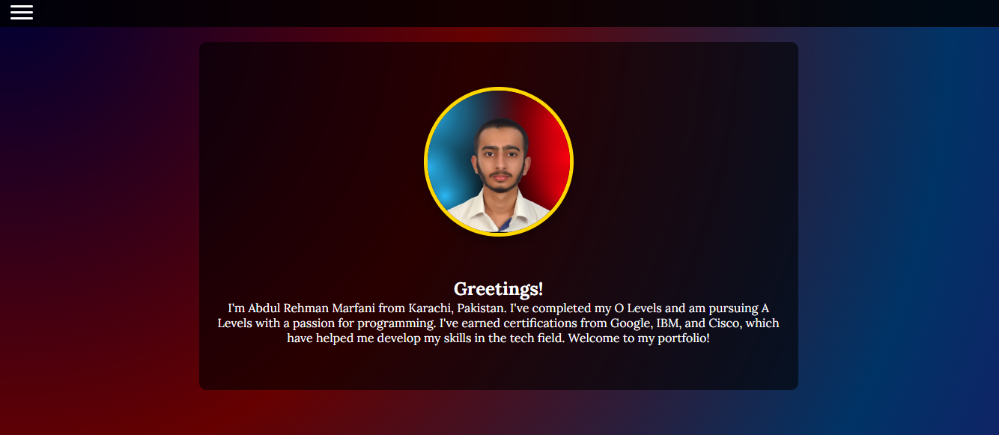
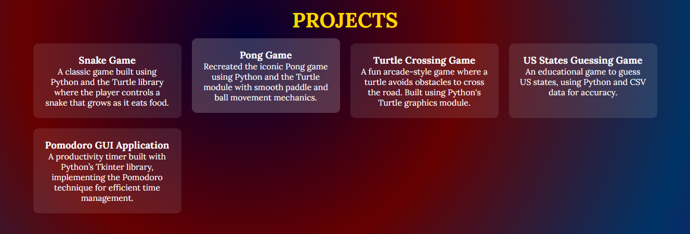
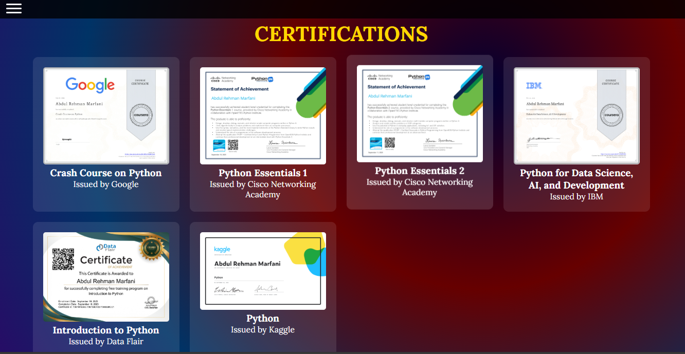

# Abdul Rehman Marfani - Portfolio

Welcome to my portfolio repository! This project showcases my personal and professional journey, including my projects, certifications, and skills. Built with HTML, CSS, and JavaScript, this website reflects my passion for web development and programming.

---

## 🌟 Features

- **About Section**: Learn about me and my background, including my academic journey and certifications.
- **Projects Section**: Highlighting various Python-based projects like the Snake Game, Pong Game, and more.
- **Certifications Section**: Showcasing certifications from top institutions like Google, IBM, and Cisco.
- **Connect Section**: Links to my LinkedIn and GitHub profiles for networking and collaboration.
- **Responsive Design**: Optimized for both desktop and mobile devices.
- **Cool Hover Effects**: Dynamic interactions on profile pictures, project cards, and navigation items.
- **Interactive Modal**: Clickable certifications that open in a modal view for closer inspection.

---

## 🚀 Live Demo

Check out the live version of my portfolio here: [Your Website Link](https://abdulrehmanmarfani.github.io/portfolio/)  

---

## 🛠️ Technologies Used

- **HTML5**: Structuring the website content.
- **CSS3**: Styling with gradients, animations, and hover effects.
- **JavaScript**: Adding interactivity (e.g., responsive navigation menu, modal functionality).

---

## 📸 Screenshots

### 📌 About Section  
  

### 📌 Projects Section  
  

### 📌 Certifications Modal  
  

---

## 📂 Folder Structure

```
├── index.html         # Main HTML file
├── styles.css         # Custom CSS for styling
├── script.js          # JavaScript for interactivity
├── assets/            # Folder containing images and assets
│   ├── profile-pic.png
│   ├── project-images/
│   └── certification-images/
└── README.md          # Project documentation
```

---

## ✨ How to Use

1. Clone this repository:
   ```bash
   git clone https://github.com/AbdulRehmanMarfani/portfolio.git
   ```
2. Navigate to the project directory:
   ```bash
   cd portfolio
   ```
3. Open `index.html` in your browser to view the portfolio.

---

## 📚 Projects

Here are some featured projects showcased in this portfolio:

1. **Snake Game**  
   A classic game built using Python, where the snake grows as it eats food.

2. **Pong Game**  
   A recreation of the iconic Pong game with smooth paddle and ball mechanics.

3. **Turtle Crossing Game**  
   An arcade-style game where a turtle avoids obstacles to cross the road.

4. **Pomodoro GUI Application**  
   A productivity timer implementing the Pomodoro technique, built with Python's Tkinter library.

*(For more details, visit the Projects section on the portfolio website.)*

---

## 📜 Certifications

This portfolio includes certifications from the following institutions:

- **Crash Course on Python** by Google  
- **Python Essentials 1 & 2** by Cisco Networking Academy  
- **Python for Data Science, AI, and Development** by IBM  
- **Introduction to Python** by Data Flair  
- **Python** by Kaggle  

*(Certificates are clickable and open in an interactive modal.)*

---

## 🤝 Connect with Me

- **LinkedIn**: [Abdul Rehman Marfani](https://linkedin.com/in/abdul-rehman-marfani-4aa587276)  
- **GitHub**: [AbdulRehmanMarfani](https://github.com/AbdulRehmanMarfani)  
- **Email**: [abdulrehmanmarfani84@gmail.com](mailto:abdulrehmanmarfani84@gmail.com)

---

## 🔧 Future Enhancements

- Add a blog section to share articles and insights.
- Implement Three.js animations for more dynamic visuals.
- Enhance accessibility features for better user experience.

---

## 📜 License

This project is open-source and available under the [MIT License](./LICENSE).

Feel free to fork, modify, and use this portfolio as a template for your own projects!

---
```
